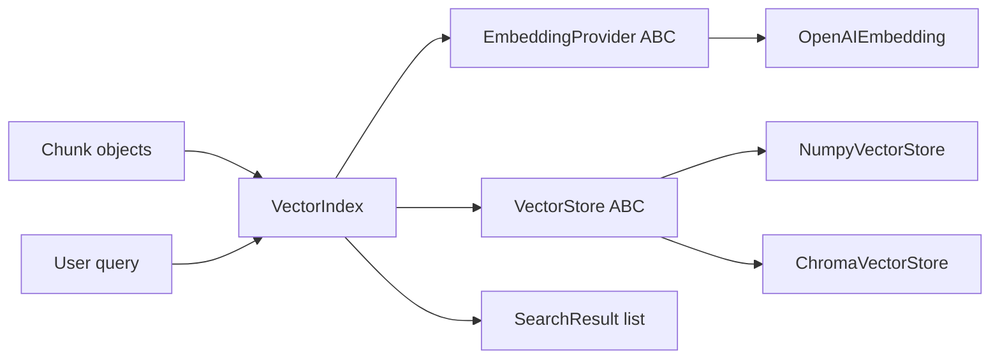

# Vectorstore Implementation Plan

A comprehensive, extensible vectorstore library for semantic search over pre-chunked data. First-class backends: **NumPy** (in-memory + file persistence) and **Chroma** (persistent local DB). Embeddings via **OpenAI**. Designed so new stores/embedders plug in behind small ABCs.

## Context and constraints

- Greenfield `uv` project, Python 3.14 (`.python-version`), empty `pyproject.toml` deps.
- Sample corpus at `data/corpora/nautilus/` (markdown files under `raw/`, CSVs under `misc/`, manifest under `manifests/`). Ingestion/chunking is out of scope — the library consumes already-made chunks.
- **Chroma must be `>=1.5.5`** — earlier versions fail to import on Python 3.14 (pydantic v1 compat layer removed in 1.5.5).
- Scope (agreed): index/upsert/delete, similarity search with metadata filtering, persistence. No MMR/hybrid/reranking in v1 (leave seams for later).

## Architecture



Separation of concerns:

- `EmbeddingProvider` turns text into vectors. Knows nothing about storage.
- `VectorStore` stores vectors + chunks and does k-NN search. Knows nothing about embedding.
- `VectorIndex` composes the two and is the only API most callers touch.

## Package layout

```
src/vectorstore/
├── __init__.py          # public exports: Chunk, SearchResult, VectorIndex, create_store, ...
├── models.py            # Chunk, SearchResult, MetadataFilter
├── index.py             # VectorIndex
├── embeddings/
│   ├── __init__.py
│   ├── base.py          # EmbeddingProvider ABC
│   └── openai.py        # OpenAIEmbedding
└── stores/
    ├── __init__.py
    ├── base.py          # VectorStore ABC
    ├── registry.py      # create_store() factory + register_store()
    ├── numpy_store.py   # NumpyVectorStore
    └── chroma_store.py  # ChromaVectorStore
tests/
├── conftest.py          # FakeEmbedding, corpus fixtures
├── test_numpy_store.py
├── test_chroma_store.py
├── test_stores_contract.py   # shared behavior suite parametrized over both stores
└── test_index.py
main.py                  # demo over the nautilus corpus
```

Configure `pyproject.toml` for a src layout (`[tool.uv]` / hatchling `packages = ["src/vectorstore"]`).

## Module details

### `models.py`

```python
@dataclass(frozen=True)
class Chunk:
    id: str
    text: str
    metadata: dict[str, str | int | float | bool] = field(default_factory=dict)

@dataclass(frozen=True)
class SearchResult:
    chunk: Chunk
    score: float   # cosine similarity in [-1, 1]; higher is better
```

**Metadata filter format** — a plain dict, backend-agnostic:

```python
# equality:            {"doc_type": "runbook"}
# membership:          {"doc_type": {"$in": ["runbook", "known_issue"]}}
# comparison:          {"priority": {"$gte": 2}}   # $gt/$gte/$lt/$lte
# multiple keys are ANDed together
MetadataFilter = dict[str, object]
```

Each backend translates this dict itself (NumPy: Python predicate; Chroma: `where` clause). Keep v1 to equality/`$in`/comparison + implicit AND; no `$or`/nesting.

### `embeddings/base.py`

```python
class EmbeddingProvider(ABC):
    @property
    @abstractmethod
    def dimension(self) -> int: ...

    @abstractmethod
    def embed_texts(self, texts: list[str]) -> list[list[float]]: ...

    def embed_query(self, text: str) -> list[float]:
        return self.embed_texts([text])[0]
```

`embed_query` is a default passthrough; providers with asymmetric query/document modes can override it.

### `embeddings/openai.py`

- `OpenAIEmbedding(model="text-embedding-3-small", api_key=None, batch_size=128, dimensions=None)`.
- API key from arg or `OPENAI_API_KEY` env var; raise a clear error if missing.
- `dimension`: known table for `text-embedding-3-small` (1536) / `-3-large` (3072), or the explicit `dimensions` arg.
- `embed_texts` batches requests (`batch_size` per call) and retries on `RateLimitError`/`APIConnectionError` with exponential backoff (use the `openai` SDK's built-in `max_retries` where possible; don't hand-roll more than a thin loop).
- Preserve input order (OpenAI returns embeddings with `index`; sort by it).

### `stores/base.py`

```python
class VectorStore(ABC):
    @abstractmethod
    def upsert(self, chunks: list[Chunk], vectors: list[list[float]]) -> None: ...
    @abstractmethod
    def delete(self, ids: list[str]) -> None: ...
    @abstractmethod
    def search(self, vector: list[float], k: int = 5,
               filter: MetadataFilter | None = None) -> list[SearchResult]: ...
    @abstractmethod
    def get(self, ids: list[str]) -> list[Chunk]: ...
    @abstractmethod
    def count(self) -> int: ...
```

Contract notes (encode these in the shared test suite):

- `upsert` with an existing id replaces vector + text + metadata.
- `search` returns results sorted by score descending, at most `k`, never includes deleted ids.
- `delete` of a nonexistent id is a no-op.
- Scores are cosine similarity for both backends so results are comparable.

### `stores/numpy_store.py`

- Internal state: `dict[str, int]` id→row, `np.ndarray (n, dim) float32` of **L2-normalized** vectors, parallel list of `Chunk`s. Normalizing at insert makes search a single mat-vec dot product.
- `search`: `scores = matrix @ query_normalized`; apply filter as a boolean mask over chunks *before* top-k (`np.argpartition` then sort the slice) so `k` results survive filtering.
- Filter evaluation: small helper `matches(metadata, filter) -> bool` implementing equality/`$in`/`$gt`/`$gte`/`$lt`/`$lte`.
- Upsert of an existing id overwrites its row in place; deletes mark rows via mask and compact lazily (or simply rebuild the matrix on delete — corpus sizes here don't justify cleverness; **rebuild-on-delete is fine for v1**).
- Persistence: `save(path)` writes `path/vectors.npz` (matrix + ids array) and `path/chunks.json` (id, text, metadata). Classmethod `NumpyVectorStore.load(path)`. Store the embedding dimension and validate on load.

### `stores/chroma_store.py`

- `ChromaVectorStore(path=".chroma", collection_name="default")` wrapping `chromadb.PersistentClient(path)`; `get_or_create_collection(name, metadata={"hnsw:space": "cosine"})`.
- Chroma returns cosine *distance*; convert with `score = 1 - distance` so both backends report similarity.
- `upsert` → `collection.upsert(ids, embeddings, documents, metadatas)`. Chroma rejects empty metadata dicts — pass `None` for chunks with no metadata.
- Filter translation to Chroma `where`: equality maps to `{"key": {"$eq": v}}`, `$in`/comparisons map 1:1; multiple keys wrap in `{"$and": [...]}` (Chroma requires explicit `$and` for >1 condition).
- `get`/`delete`/`count` map directly to collection methods. Persistence is inherent in `PersistentClient`.

### `stores/registry.py`

```python
_REGISTRY: dict[str, Callable[..., VectorStore]] = {}

def register_store(name: str, factory: Callable[..., VectorStore]) -> None: ...
def create_store(name: str, **kwargs) -> VectorStore: ...   # raises on unknown name

register_store("numpy", NumpyVectorStore)
register_store("chroma", ChromaVectorStore)
```

Import `chromadb` lazily inside `chroma_store.py` usage so the numpy path works without chroma installed (optional-dependency friendly later).

### `index.py`

```python
class VectorIndex:
    def __init__(self, embedder: EmbeddingProvider, store: VectorStore): ...

    def index(self, chunks: list[Chunk]) -> None:
        # embed in batches (embedder handles batching) then store.upsert
    def search(self, query: str, k: int = 5,
               filter: MetadataFilter | None = None) -> list[SearchResult]: ...
    def delete(self, ids: list[str]) -> None: ...
    def count(self) -> int: ...
```

Deliberately thin — no chunking, no caching in v1.

## Demo (`main.py`)

1. Walk `data/corpora/nautilus/raw/**/*.md`; each file becomes one `Chunk` (id = relative path, metadata = `{"doc_type": <parent folder name>}`). This is a stand-in for real ingestion.
2. Build `VectorIndex(OpenAIEmbedding(), create_store("chroma", path=".chroma"))` (flag/env to pick `numpy`).
3. Index, then run 2–3 sample queries (e.g. "users can't log in after certificate rotation", "payment export totals don't match dashboard") and print ranked results with scores, ids, and a text snippet — with and without a `doc_type` filter.
4. Requires `OPENAI_API_KEY`; exit with a friendly message if unset.

## Tests (offline, no API)

- `FakeEmbedding` in `conftest.py`: deterministic, e.g. hash tokens into a small fixed-dim bag-of-words vector, so "similar" texts sharing words score higher. Never calls the network.
- `test_stores_contract.py`: one parametrized suite run against both `NumpyVectorStore` and `ChromaVectorStore(tmp_path)` covering: upsert/replace semantics, delete (incl. nonexistent id), search ordering + top-k, every filter operator, empty-store search, `get`/`count`.
- `test_numpy_store.py`: save/load round-trip, dimension validation on load.
- `test_chroma_store.py`: persistence across client re-open, empty-metadata handling, `$and` translation with multi-key filters.
- `test_index.py`: `VectorIndex` end-to-end with `FakeEmbedding` + numpy store.

## Dependencies and setup

```bash
uv add numpy "chromadb>=1.5.5" openai
uv add --dev pytest
```

Update `README.md`: install, `OPENAI_API_KEY` setup, quickstart snippet, running tests/demo.

## Verification

- `uv run pytest` must pass fully offline.
- If `OPENAI_API_KEY` is available: `uv run python main.py` and sanity-check that the cert-rotation query surfaces `ticket-8830-branch-users-login-failure-after-cert-rotation.md` / related runbooks near the top.

## Implementation order

1. Dependencies + src-layout `pyproject.toml`.
2. `models.py` (Chunk, SearchResult, filter helper `matches()`).
3. `embeddings/base.py` + `openai.py`.
4. `stores/base.py` + `numpy_store.py` (+ save/load).
5. `stores/chroma_store.py` (+ filter translation).
6. `stores/registry.py` + `index.py` + `__init__.py` exports.
7. Tests (contract suite first, then backend-specific).
8. Demo `main.py` + README.

## Explicit non-goals for v1 (future seams)

- MMR / diversity re-ranking (add as a post-processing step on `VectorIndex.search`).
- Hybrid keyword+vector search (would add a `TextSearchable` mixin on stores).
- Async API, additional backends (pgvector, Qdrant — register via `register_store`).
- Chunking/ingestion pipeline and the manifest-driven metadata enrichment.
